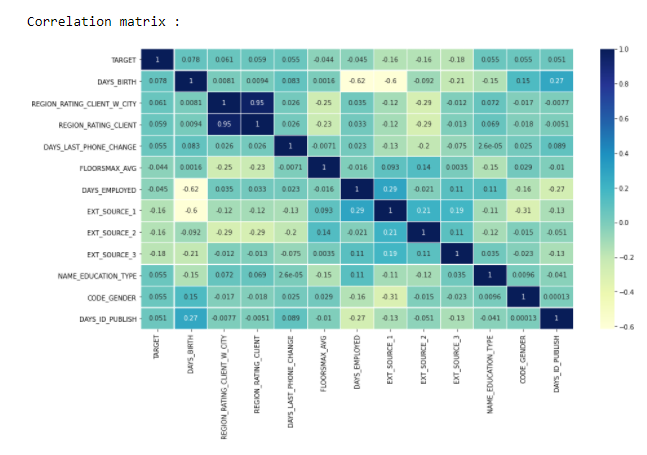
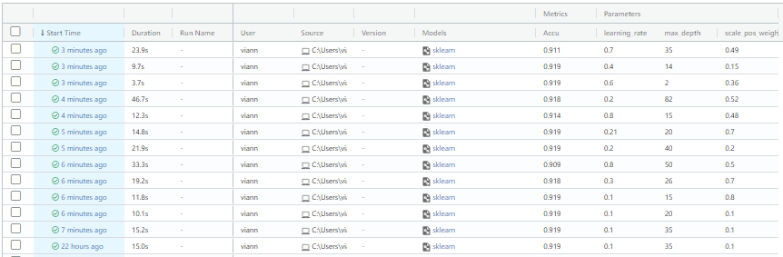

.. Application of big data documentation master file, created by
   sphinx-quickstart on Tue Nov 16 16:49:10 2021.
   You can adapt this file completely to your liking, but it should at least
   contain the root `toctree` directive.

Welcome to Application of big data's documentation!
===================================================

**Application of bigdata** (/Our project/) is a python project, that train us to 
apply tools and concepts seen in course.  It pulls data from the 
`DataSet ofHome Credit Risk Classification <https://www.kaggle.com/c/home-credit-default-risk/overview>`.

To run our program correctly, you will need to run the different python scripts in the following order :

	1. Cleaning_Dataset.ipynb
	2. Features_Engineering.ipynb
	3. Training_model.ipynb
	4. Shap.ipynb
	

Part 1 :
---------

In the first part, we build a machine learning project using jupyter notebook, github, a conda envirenement and sphinx.
We tried to separate the different workflow into different scripts, one for the data preparation,
one for the data preparation, one for the feature engineering, one for the models training and a 
last one for the prediction.

**Data preparation** :

We first clean the dataset from all the NAN values.

- **init()**, will return the cleaned dataset

**Feature engineering** :

We have done a correlation matrix, and from that we have kept the most correlacted features and deleted the least correlated ones.

Here is the correlation matrix :

- **matrice_corr(df_train,df_test)**, is a void function that show us the correlation matrix
- **setup_train(df_train,df_test)**, will return four values (X_train, X_test, y_train and y_test)

**Models training and predict** : 

We had to train three models: XGboost, Random Forest and Gradient Boosting.
The XGboost model, is done with the optimized distributed gradient boosting library, XGboost.
The Ramdom Forest model, consists of many decision trees.
The Gradient Boosting model, is an ensemble of weak prediction models(decision trees).

- **XGBC_model(X_train,X_test,y_train,y_test,learning_rate,max_depth,scale_pos_weight)**, The XGBOOST model is a supervised learning algorithm whose principle is to combine the results of a set of models. The idea is simple: instead of using a single model, the algorithm will use several which will then be combined to obtain a single result .
- **RF_model(X_train,X_test,y_train,y_test)**, The random forest algorithm performs parallel learning on multiple randomly constructed decision trees trained on different subsets of data.
- **GB_model(X_train,X_test,y_train,y_test)**, Gradient boosting is a machine learning technique used in regression and classification tasks, among others. It gives a prediction model in the form of an ensemble of weak prediction models, which are typically decision trees. When a decision tree is the weak learner, the resulting algorithm is called gradient-boosted trees; it usually outperforms random forest.

Those functions train the different models.

All three model, succeed in predicting if a client could get a loan. Most had each around 0.91 of accuracy.

.. figure:: ./images/capture_accu.png
   :alt: Image à rajouter
   :align: center

Part 2 :
---------

In this part, we got introduced to MLFLOW. We decided to track the parameters of the XGboost model.
It helped us to choose the best parameter, to have better result, with our model.

Here we can have a look at MLFlow:

   
To deploy the model in a local REST server in order to establish predictions we just have to execute this command using the id of run mlflow :

.. code-block:: batch
  
  mlflow models serve --model-uri runs:/8518896a4caa45e696754f20df19ff47/model --port 1244

After that it will then be possible to request this local address to access the model with :

.. code-block:: batch
  
  curl http://127.0.0.1:1244/invocations

or with python package requests :

.. code-block:: python
  
  import json
  import requests
  
  url = 'https://127.0.0.1:1244/invocations'
  headers = {'Content-Type' : 'application/json'}
  request_data = json.dumps(...)
  response = request.post(url,request_data,headers=headers)

Part 3 :
---------

Finaly, we used SHAP Library on our XGboost model to understand it.
We can visualize three graph by running the following function. 

The first one is to visualize the explainations for a specific value,
we choose to select the 100th value, and we observed that the day of the last time the person changed his phone had a lot of influence on the 
result of the prediction.

The second, is a the same as the one just seen but for all the values of the dataset. We can see the day of birth is the most influent between all the features.

The last one, is a summary plot for each class of the dataset.

Here is the graph for a specific value :

.. figure:: ./images/shap_1.png
   :alt: Texte alternatif
   :align: center
   
Here is the graph for all values :

.. figure:: ./images/shap_2.png
   :alt: Texte alternatif
   :align: center

Here a summary plot for each class on the whole dataset :

.. figure:: ./images/shap_3.png
   :alt: Texte alternatif
   :align: center
   
   
- **get_explainer(xg_clf,X_train_test)**, is a void function that print the three graphs

.. toctree::
   :maxdepth: 2
   :caption: Contents:

Indices and tables
==================

* :ref:`search`
